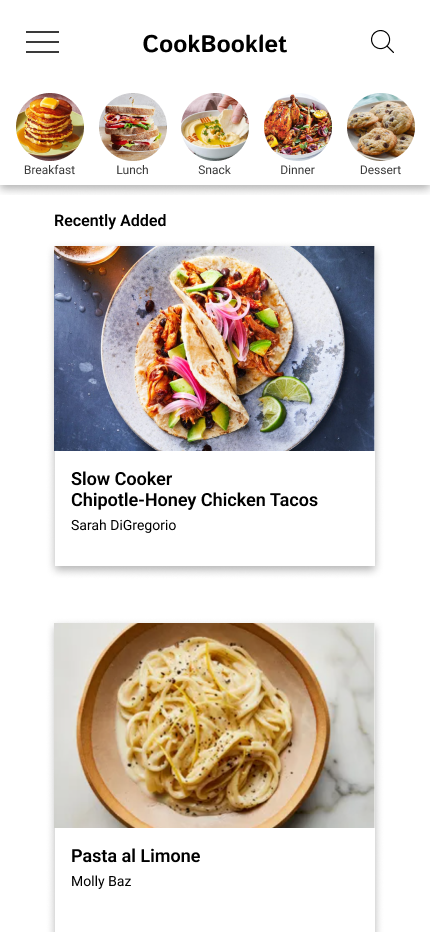
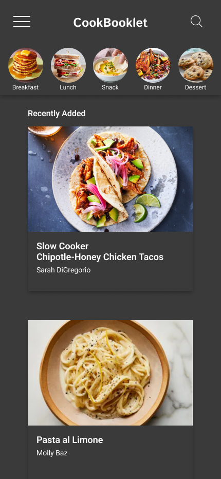
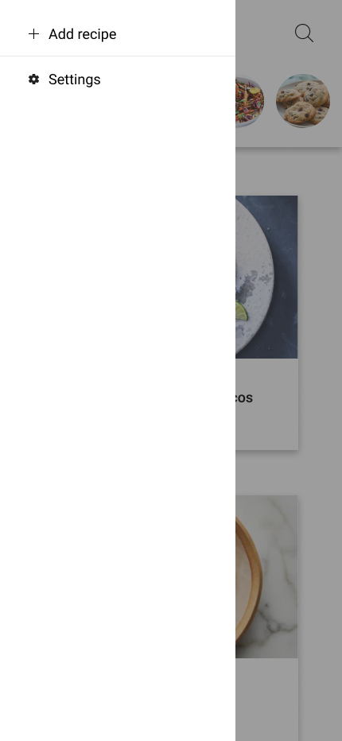

# Recipe-App
Recipe app capable of storing, adding, and updating recipes.

## User Stories
- AAU I want to be able to create, update, and delete recipes.
- AAU a user, I want to be able to add ingredients to my recipes and specify quantities.
- AAU a user, I want to be able to categorize my recipes (e.g., breakfast, lunch, snack, dinner, dessert).
- AAU a user, I want to be able to search for recipes by name, category, or ingredient.
- AAU a user, I want to be able to view all my recipes.
## MVP (Minimum Viable Product)
- Implement CRUD functionality for recipes and ingredients.
- Create recipe categories (i.e., Breakfast, Lunch, Snack, Dinner, Dessert).
- Add a search feature that can find recipes based on different inputs.
## Stretch Goals
- Create features such as ratings and comments.
- Implement image upload for recipes.
- Add user sign-in functionality.
- Create a feature where a user can create a custom recipe category (i.e., "Christmas", "Thanksgiving") to further categorize their recipes.
## ERD Design

- This was the initial ERD, but I ran into issues with the recipeIngredient junction table.
- The recipeIngredient junction table was scrapped, so Ingredient and Unit connect directly to Recipe now.
- And the User schema become a Categoriy schema.
## Wireframe / Figma

## Instructions for Forking, Cloning, and Setting Up the Project
- Fork the Repository: Click on the "Fork" button at the top right corner of the repository page to create your copy of the project.
- Clone the Repository: Copy the URL of your forked repository and run git clone <repository-url> in your terminal.
- Install Dependencies: Navigate to the project directory and run npm install to install all required dependencies, including inti -y, mongoose, express, cors, nodemon, body-parser, morgan.
- Run the Project: Start the server by running npm start or nodemon.
## Features
- Page navigation between meal categories and recipe-specific pages.
- Menu page that slides out over every page and offers an "Add recipe" and "Settings" section
- Ability to add a recipe, which will automatically populate its categories database and appear on the category page on the frontend.
## Next Steps
- Add new ingredients to databse: Currently, ingredients are limited to the backend. Ingredients must exist in the backend to be added to a recipe.
- Expand search functionality: Enable search queries by ingredient, recipe source, and cook/prep time, etc.
- Implement edit/update functionality: Add an edit/update icon on each recipe page to allow users to amend any piece of data.
## Resources
- ERD - https://www.reddit.com/r/SQL/comments/xy74h1/recipe_app_database_design/
- GA Lessons and classmate Hackathon projects